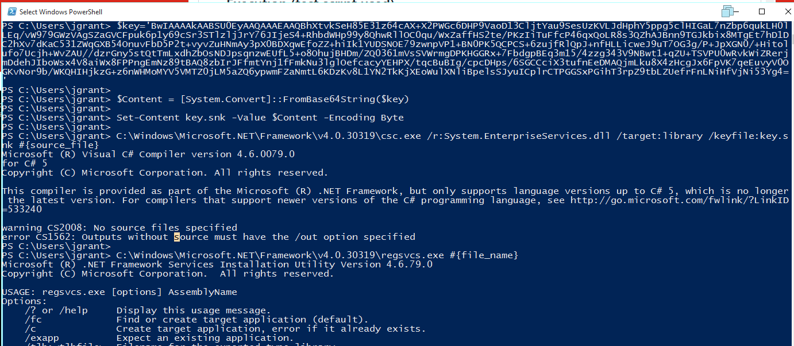

## Technique Description

To avoid detection, adversaries look to use genuine software in order to execute code. In this case, regsvcs and regasm can be used to bypass application whitelisting 


## Execution (test script used)

**Run with powershell:** 
$key='BwIAAAAkAABSU0EyAAQAAAEAAQBhXtvkSeH85E31z64cAX+X2PWGc6DHP9VaoD13CljtYau9SesUzKVLJdHphY5ppg5clHIGaL7nZbp6qukLH0lLEq/vW979GWzVAgSZaGVCFpuk6p1y69cSr3STlzljJrY76JIjeS4+RhbdWHp99y8QhwRllOC0qu/WxZaffHS2te/PKzIiTuFfcP46qxQoLR8s3QZhAJBnn9TGJkbix8MTgEt7hD1DC2hXv7dKaC531ZWqGXB54OnuvFbD5P2t+vyvZuHNmAy3pX0BDXqwEfoZZ+hiIk1YUDSNOE79zwnpVP1+BN0PK5QCPCS+6zujfRlQpJ+nfHLLicweJ9uT7OG3g/P+JpXGN0/+Hitolufo7Ucjh+WvZAU//dzrGny5stQtTmLxdhZbOsNDJpsqnzwEUfL5+o8OhujBHDm/ZQ0361mVsSVWrmgDPKHGGRx+7FbdgpBEq3m15/4zzg343V9NBwt1+qZU+TSVPU0wRvkWiZRerjmDdehJIboWsx4V8aiWx8FPPngEmNz89tBAQ8zbIrJFfmtYnj1fFmkNu3lglOefcacyYEHPX/tqcBuBIg/cpcDHps/6SGCCciX3tufnEeDMAQjmLku8X4zHcgJx6FpVK7qeEuvyV0OGKvNor9b/WKQHIHjkzG+z6nWHMoMYV5VMTZ0jLM5aZQ6ypwmFZaNmtL6KDzKv8L1YN2TkKjXEoWulXNliBpelsSJyuICplrCTPGGSxPGihT3rpZ9tbLZUefrFnLNiHfVjNi53Yg4='

$Content = [System.Convert]::FromBase64String($key)

Set-Content key.snk -Value $Content -Encoding Byte

C:\Windows\Microsoft.NET\Framework\v4.0.30319\csc.exe /r:System.EnterpriseServices.dll /target:library /keyfile:key.snk #{source_file}

C:\Windows\Microsoft.NET\Framework\v4.0.30319\regsvcs.exe #{file_name}

del #{file_name}

del key.snk



## Detection -- Visibility -- Filter/ Correlation Rule

**Filter:** ```System.EnterpriseServices.dll key.snk OR regsvcs```
